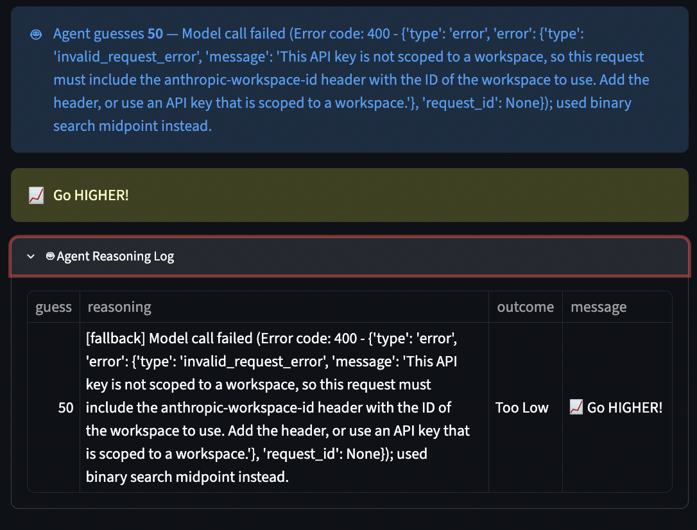

# 🎮 Game Glitch Investigator + AI Agent

## Original Project (Modules 1)

This project builds on **Game Glitch Investigator: The Impossible Guesser**, a Streamlit number-guessing game from Modules 1. It shipped intentionally broken: hints pointed the wrong direction, "New Game" didn't reset state, and the attempt counter was off by one, and the original goal was to debug and refactor it into a working game: fix the hint logic, fix session-state handling, and move game logic out of `app.py` into a testable `logic_utils.py` module.

## Project Summary

**Game Glitch Investigator + AI Agent** is the fixed number-guessing game extended with an optional AI Agent mode: instead of a human typing guesses, Claude proposes each guess (with a one-sentence rationale), wrapped in a guardrail that never lets a bad or missing model response affect the game. It matters because it demonstrates the core pattern for shipping an LLM feature safely — the model is a *suggestion source*, not something the app blindly trusts, so the game keeps working even if the API is down, the key is missing, or the model hallucinates an invalid move.

## Architecture Overview

The full system diagram is in [diagrams/architecture.mmd](diagrams/architecture.mmd) (Mermaid — view in VS Code's Mermaid preview, on GitHub, or at mermaid.live).

At a high level:

- **`app.py` (UI)** — Streamlit front end. Lets the player pick Manual or AI Agent mode, and routes every guess (manual or agent) through one shared `process_guess()` path so both modes play by identical rules.
- **`ai_agent.py` (Agent + Guardrail)** — `propose_guess()` calls Claude with the current search bounds and guess history via a `make_guess` tool call. `safe_agent_guess()` wraps it: any out-of-range guess, repeat guess, malformed response, or API exception is caught and replaced with a deterministic binary-search midpoint (`_midpoint_fallback()`). Callers only ever use `safe_agent_guess`.
- **`logic_utils.py` (Evaluator)** — `check_guess()` and `update_score()` are the single source of truth for win/too-high/too-low and scoring, shared by both play modes.
- **Human checkpoints** — the "Agent Reasoning Log" and "Developer Debug Info" panels in the UI let a player inspect every agent guess, its reasoning, and its source (`llm` vs `fallback`) against the actual secret. `logs/agent.log` records the same events for offline review.
- **`tests/` (Testing)** — `pytest` exercises the guardrail and game logic against a mocked Anthropic client, so correctness is verified without any API key or network access.

## Setup Instructions

1. Clone the repo and `cd` into it.
2. Create and activate a virtual environment (optional but recommended):
   ```bash
   python3 -m venv .venv
   source .venv/bin/activate
   ```
3. Install dependencies:
   ```bash
   pip install -r requirements.txt
   ```
4. (Optional — enables AI Agent mode) Set your Anthropic API key:
   ```bash
   export ANTHROPIC_API_KEY=your-key-here
   ```
5. Run the app:
   ```bash
   python -m streamlit run app.py
   ```
6. Run the test suite:
   ```bash
   pytest
   ```

## Sample Interactions

**1. Manual guess, hint logic**
```
Input:  guess=45, secret=52
Output: Too Low | "📈 Go HIGHER!"
```

**2. AI Agent mode with no API key configured** — guardrail falls back automatically instead of failing:
```
Input:  safe_agent_guess(low=1, high=100, history=[], client=None)
Output: guess=50, source=fallback
        reasoning: "No API client configured — used binary search midpoint."
```
<p align="center">
  
</p>

**3. AI Agent mode, model returns an invalid guess** — Claude proposes `999`, which is outside the `1–100` search range; the guardrail rejects it and substitutes the deterministic midpoint instead of passing the bad value through to the game:
```
Input:  model proposes guess=999 (bounds are 1-100)
Output: guess=50, source=fallback
        reasoning: "Model guess 999 was invalid; used binary search midpoint instead."
```

**4. AI Agent mode, valid model response** — accepted as-is:
```
Input:  model proposes guess=50 for bounds 1-100
Output: guess=50, source=llm
        reasoning: "Starting at the midpoint of 1-100 to halve the search space."
```

## Design Decisions

- **Guardrail-first, not prompt-first.** Rather than trying to prompt Claude into never misbehaving, `safe_agent_guess()` treats every model response as untrusted input and validates it in code (range check, repeat check, type check) before it can touch game state. Trade-off: this adds a layer of code the model output has to pass through, but it means a hallucinated or malformed response degrades gracefully to a deterministic fallback instead of crashing the game or corrupting `session_state`.
- **Deterministic fallback (binary search), not "retry the model."** On any failure, the fallback is a plain binary-search midpoint — no extra API calls, no added latency, and it's probably correct (see `test_fallback_only_agent_converges`). Trade-off: it's less "intelligent" than asking the model again, but it's simpler, free, and can't fail the same way twice.
- **One shared `process_guess()` path for both modes.** Manual and AI Agent guesses run through identical scoring/win-loss logic so the agent is a genuine alternate way to play, not a parallel code path that could drift out of sync with manual mode.
- **Logic split out of `app.py`.** `check_guess`/`update_score` live in `logic_utils.py` specifically so they're unit-testable without spinning up Streamlit. Trade-off: an extra module/import to maintain, in exchange for a test suite that runs in milliseconds with no UI dependency.
- **Fail open on missing credentials, not fail closed.** If `ANTHROPIC_API_KEY` isn't set, AI Agent mode is simply disabled with a message and the app falls back to Manual mode, rather than erroring out on first click.

## Testing Summary

- **What worked:** All 21 tests pass (`7` in `tests/test_ai_agent.py`, `14` in `tests/test_game_logic.py`). The guardrail tests confirm the agent falls back correctly on out-of-range guesses, repeated guesses, and simulated API exceptions, and `test_fallback_only_agent_converges` proves the fallback-only path finds every possible secret from 1–100 within the theoretical binary-search bound. The game-logic tests confirm the hint-direction bug fix, the string-secret comparison path, and that "New Game" fully resets state (attempts, history, status, secret) while intentionally preserving score across games.
- **What didn't work initially:** the original hint messages were reversed ("Too High" said "Go LOWER" only after the fix — before the fix it pointed the wrong way), "New Game" didn't reset `session_state`, and the attempt counter was off by one — all caught by manual play before being locked in as regression tests.
- **What I learned:** mocking the Anthropic client (`_FakeClient`/`_FakeMessages` in `tests/test_ai_agent.py`) makes the guardrail fully testable offline — no API key or network call needed to verify that bad model output can't reach the game. It also reinforced that the guardrail, not the prompt, is what actually guarantees correctness: the tests never assert anything about what the model *should* say, only about what the app does when the model says something wrong.
